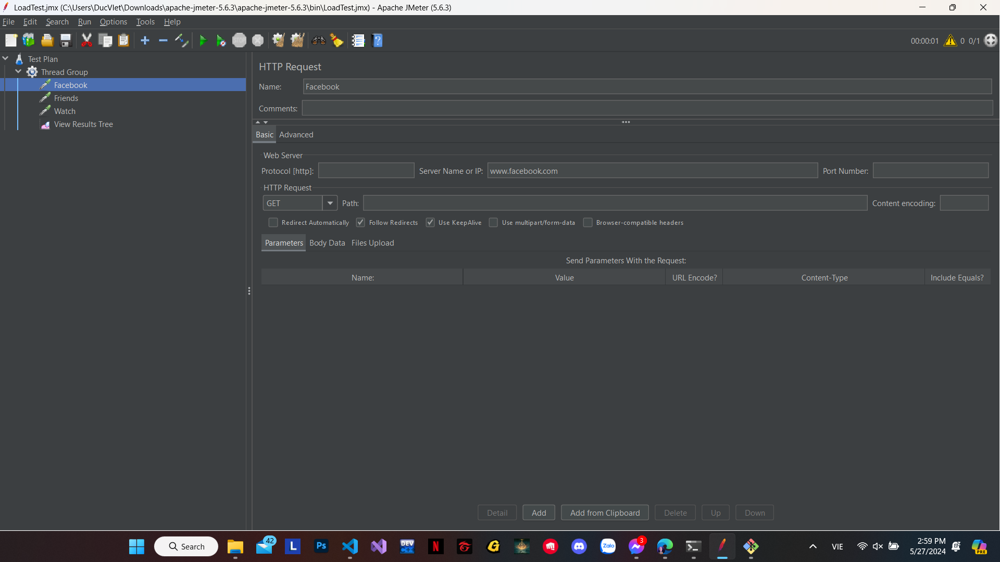
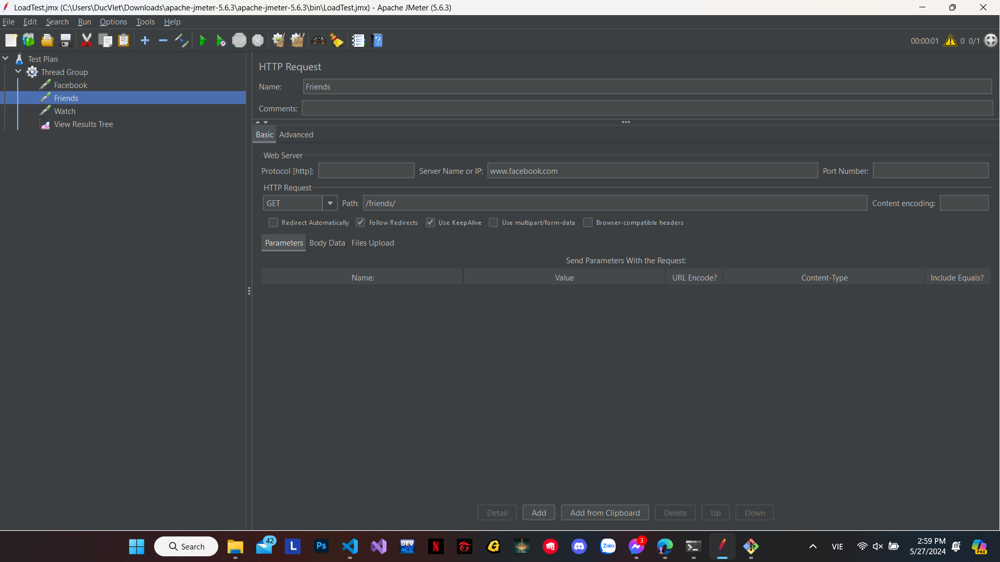
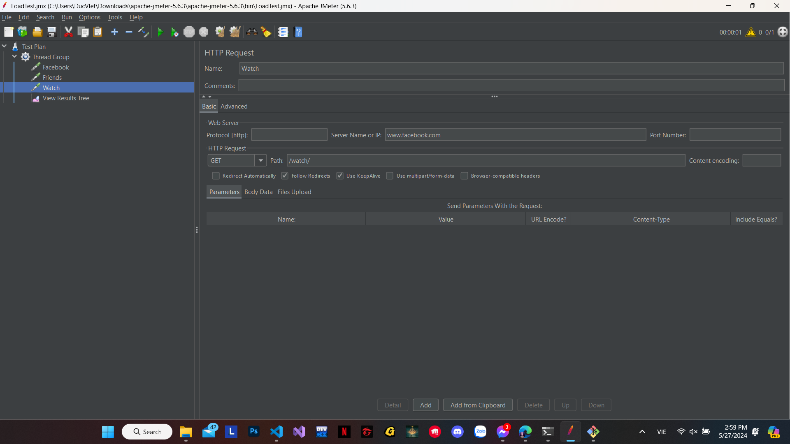
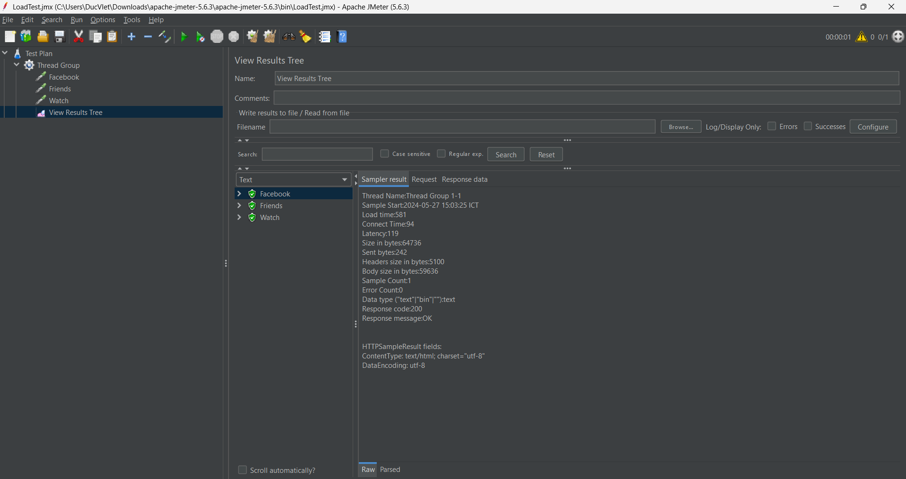
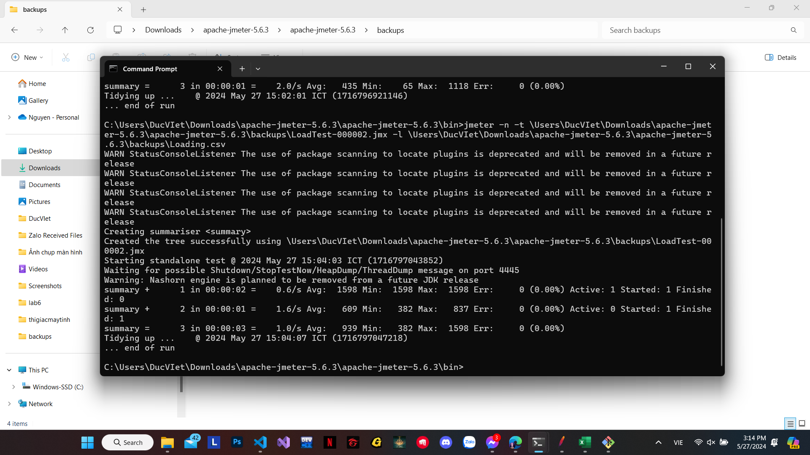
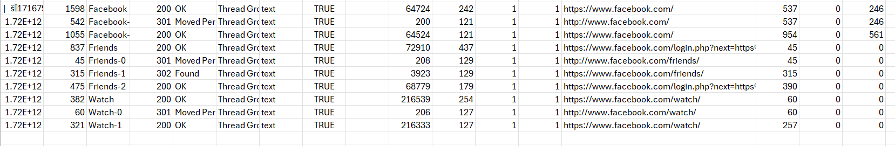
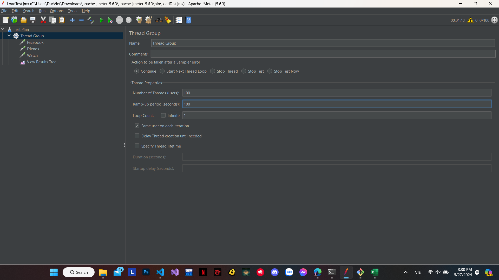
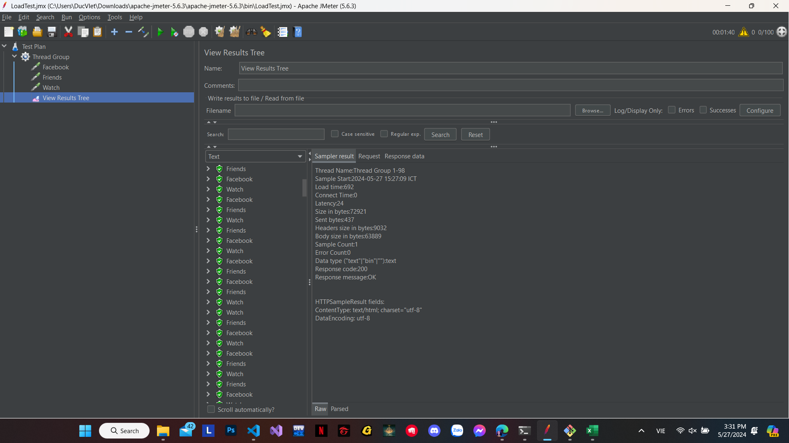
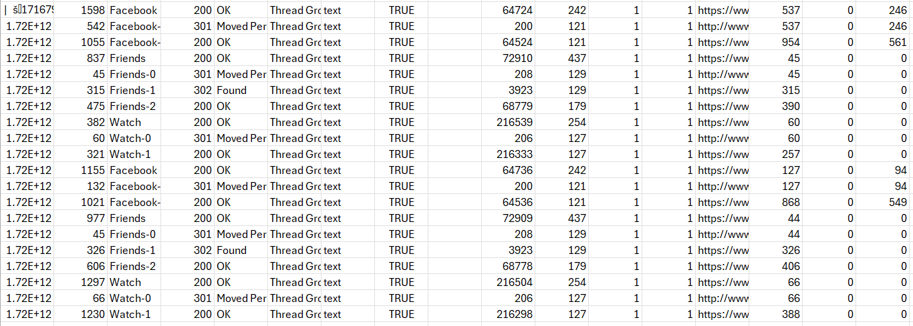

# JMeter

# Lựa chọn trang web để thực hành

- Trang web được lựa chọn sẽ là: https://www.facebook.com/

# Thêm một HTTP Request Sampler

- Thêm 2 trang web khác bao gồm:
  - Trang web thứ nhất: https://www.facebook.com/friends
  
  - Trang web thứ hai: https://www.facebook.com/watch
  

# Thêm một Listener để ghi lại kết quả

- Kết quả khi chạy:

# Tạo file Loading.csv để hiển thị thông số

# Kết quả hiển thị trong file csv

# Thay đổi cấu hình số lượng người dùng ảo: 
- Thử tăng số lượng người dùng lên: 

- Kết quả:

- Theo dõi trong csv:

# Kết luận: 
